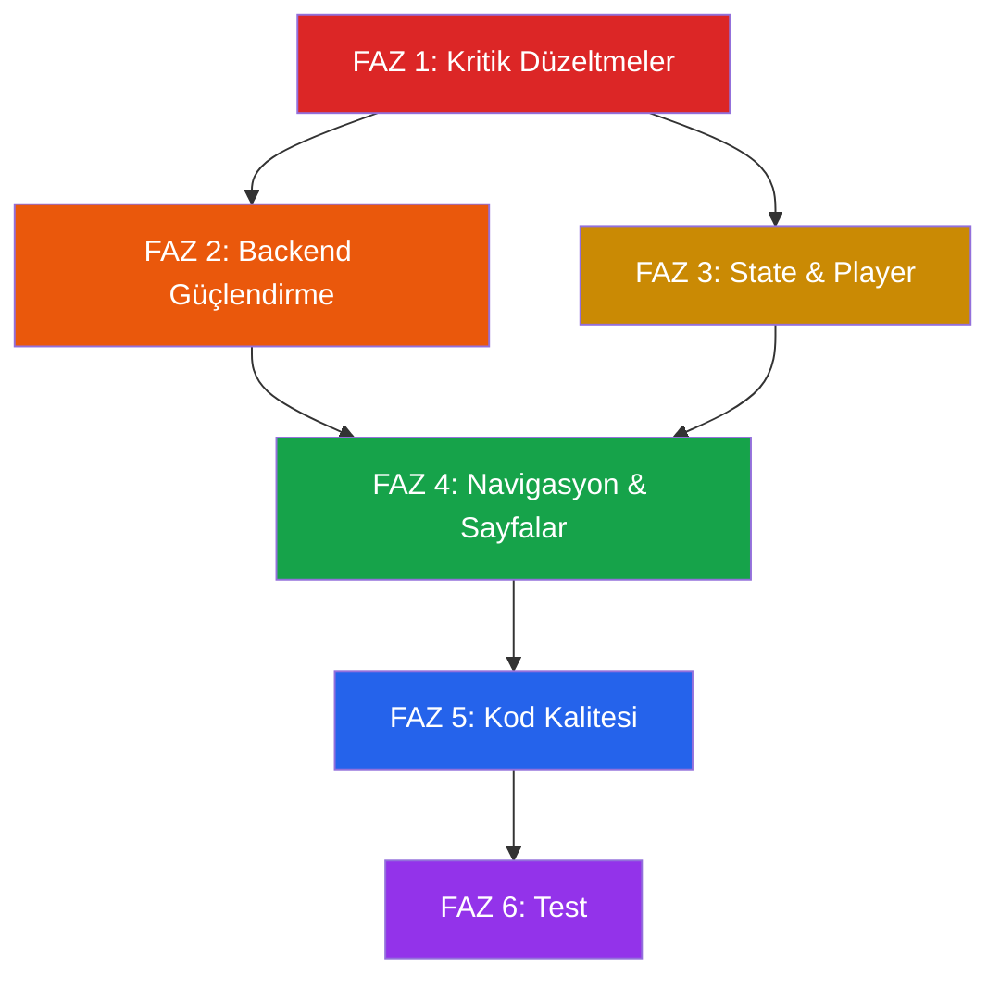

# MuseFlow — Kapsamlı Teknik Analiz & İyileştirme Planı

> **Analiz tarihi:** 16 Haziran 2026  
> **Kapsam:** Backend, altyapı, state management, player, API, güvenlik, performans, erişilebilirlik, navigasyon  
> **Kapsam dışı:** Tasarım/UI değişiklikleri (kullanıcı talebi)

---

## Mevcut Durum Özeti

| Alan | Durum | Önem |
|------|-------|------|
| YouTube API (arama) | ❌ 500 hatası veriyor | KRİTİK |
| Sidebar navigasyon | ❌ Hiçbir butona bağlı aksiyon yok | KRİTİK |
| track/[id] sayfası | ❌ Boş dizin, sayfa yok | KRİTİK |
| Player sıra yönetimi | ❌ Next/Previous yok | YÜKSEK |
| Playlist yönetimi | ⚠️ Çok ilkel, silme/düzenleme yok | YÜKSEK |
| Metadata (SEO) | ⚠️ "Create Next App" default | ORTA |
| API güvenliği | ⚠️ Rate limiting yok, API key doğrudan kullanılıyor | YÜKSEK |
| Hata yönetimi | ⚠️ Genel catch, detaysız | ORTA |
| Mobil navigasyon | ❌ Sidebar gizleniyor, alternatif yok | YÜKSEK |
| localStorage persistence | ⚠️ Hydration mismatch riski var | ORTA |
| TypeScript güvenliği | ⚠️ `as any` kullanımları mevcut | ORTA |
| next.config.ts | ⚠️ Tamamen boş, image domain vb. eksik | ORTA |
| Build | ❌ Font indirme hatası (offline build sorunlu) | ORTA |
| Test altyapısı | ❌ Hiç test yok | YÜKSEK |

---

## Tespit Edilen Sorunların Detayı

### 1. KRİTİK — YouTube API Arama Hatası (500)
- **Dosya:** [route.ts](file:///c:/Users/aykut/Desktop/music/src/app/api/search/route.ts)
- **Sorun:** `/api/search?q=Tarkan` çağrısı 500 dönüyor. YouTube Data API isteği sunucu tarafında başarısız oluyor.
- **Kök neden muhtemel:** API anahtarı geçersiz/kota dolmuş VEYA sunucu tarafından YouTube API'ye bağlantı problemi.
- **Ek sorun:** API'den dönen hata detayı loglanmıyor, sadece genel "hata oluştu" mesajı veriliyor. YouTube API'nin döndüğü gerçek hata mesajı yutulmuş.

### 2. KRİTİK — Sidebar Navigasyon Tamamen Çalışmıyor
- **Dosya:** [page.tsx](file:///c:/Users/aykut/Desktop/music/src/app/page.tsx#L123-L145)
- **Sorun:** "Akışım", "Son dinlenenler", "Favoriler" butonları hiçbir aksiyona bağlı değil. Sadece statik `<button>` elementleri.
- **Etki:** Kullanıcı navigasyon yapamıyor.

### 3. KRİTİK — track/[id] Sayfası Boş
- **Dosya:** `src/app/track/[id]/` dizini boş, hiçbir `page.tsx` yok.
- **Etki:** `/track/123` gibi URL'ler 404 verecektir.

### 4. YÜKSEK — Player Sıra (Queue) Yönetimi Yok
- **Dosya:** [PlayerContext.tsx](file:///c:/Users/aykut/Desktop/music/src/components/PlayerContext.tsx)
- **Sorun:** `PlayerState` sadece `current` track tutuyor. Queue/playlist sırası, next/previous, shuffle yok.
- **Etki:** Kullanıcı sadece tek tek şarkı çalabilir.

### 5. YÜKSEK — Playlist Yönetimi Çok İlkel
- **Dosya:** [LibraryContext.tsx](file:///c:/Users/aykut/Desktop/music/src/components/LibraryContext.tsx)
- **Sorunlar:**
  - Playlist silme yok
  - Playlist adı düzenleme yok
  - Playlist'ten şarkı kaldırma yok
  - "İlk sonucu ekle" butonu çok kısıtlı — herhangi bir şarkıyı herhangi bir listeye ekleme olanağı yok
  - Playlist içindeki şarkıları görüntüleme yok
  - Playlist çalma özelliği yok

### 6. YÜKSEK — API Güvenlik Eksiklikleri
- **Dosya:** [route.ts](file:///c:/Users/aykut/Desktop/music/src/app/api/search/route.ts)
- **Sorunlar:**
  - Rate limiting yok — saldırgan/bot trafiği API kotasını tüketebilir
  - Input sanitizasyonu yok (query string doğrudan YouTube API'ye gönderiliyor)
  - YouTube API hata yanıtının detayı loglanmıyor
  - Caching yok — aynı sorgu tekrar tekrar YouTube API'yi çağırıyor

### 7. YÜKSEK — Mobil Kullanılabilirlik
- **Dosya:** [page.tsx](file:///c:/Users/aykut/Desktop/music/src/app/page.tsx#L110)
- **Sorun:** Sidebar `hidden lg:flex` ile mobilde tamamen gizleniyor ama alternatif bir navigasyon (hamburger menü, tab bar, drawer) yok.
- **Etki:** Mobil kullanıcılar "Akışım", "Favoriler" vb. hiçbir navigasyon öğesine erişemiyor.

### 8. ORTA — Hydration Mismatch Riski
- **Dosya:** [LibraryContext.tsx](file:///c:/Users/aykut/Desktop/music/src/components/LibraryContext.tsx#L40-L59)
- **Sorun:** Sunucu tarafında boş state ile render ediliyor, client'ta `useEffect` ile localStorage'dan state yükleniyor. Bu flash/mismatch oluşturabilir.

### 9. ORTA — `useMemo` Dependency Sorunu (PlayerContext)
- **Dosya:** [PlayerContext.tsx](file:///c:/Users/aykut/Desktop/music/src/components/PlayerContext.tsx#L42-L80)
- **Sorun:** `useMemo` dependency'si olarak `[state]` verilmiş. `state` objesi her render'da yeni referans olduğu için memo etkisiz kalıyor. Callback'ler (setTrack, setPlaying vb.) her render'da yeniden oluşuyor ve tüm consumer'ları gereksiz yere re-render ettiriyor.

### 10. ORTA — TypeScript Güvenlik Sorunları
- **Dosyalar:** Birden fazla
  - `item: any` kullanımı — [page.tsx:61](file:///c:/Users/aykut/Desktop/music/src/app/page.tsx#L61)
  - `handlePlay(t as any)` — [page.tsx:467](file:///c:/Users/aykut/Desktop/music/src/app/page.tsx#L467)
  - `YouTubeEvent<any>` — [BottomPlayerBar.tsx:71-81](file:///c:/Users/aykut/Desktop/music/src/components/BottomPlayerBar.tsx#L71-L81)

### 11. ORTA — SEO / Metadata Eksik
- **Dosya:** [layout.tsx](file:///c:/Users/aykut/Desktop/music/src/app/layout.tsx#L18-L21)
- **Sorun:** Title "Create Next App", description "Generated by create next app" — default değerler değiştirilmemiş.
- **Ek:** `lang="en"` ama uygulama tamamen Türkçe.

### 12. ORTA — next.config.ts Boş
- **Dosya:** [next.config.ts](file:///c:/Users/aykut/Desktop/music/src/app/../../../next.config.ts)
- **Sorun:** YouTube thumbnail'leri için `images.remotePatterns` tanımlanmamış. `` tagı kullanılıyor, Next.js `<Image>` kullanılmıyor.

### 13. ORTA — BottomPlayerBar Layout Sorunları
- **Dosya:** [BottomPlayerBar.tsx](file:///c:/Users/aykut/Desktop/music/src/components/BottomPlayerBar.tsx)
- **Sorunlar:**
  - Progress bar, track bilgisi ve kontrol butonları doğru hizalanmamış (flex yapısı bozuk — progress üstte, track info ve kontroller alt satırda ama layout düzgün bir row oluşturmuyor)
  - `requestAnimationFrame` ile sürekli `setTime` çağırılıyor — bu her frame'de state güncellemesi ve re-render demek (yaklaşık 60 re-render/saniye)
  - `onTouchEnd` seek commit için doğru çalışmayabilir (React synthetic event sorunu)

### 14. DÜŞÜK — Build Font Hataları
- **Sorun:** Google Fonts indirme build sırasında başarısız oluyor (ağ bağlantı sorunu).
- **Çözüm:** Font'ları local olarak serve etme veya fallback tanımlama.

### 15. DÜŞÜK — Test Altyapısı
- **Sorun:** Hiçbir birim testi, entegrasyon testi veya E2E testi yok.

---

## FAZ PLANI

---

### 🔴 FAZ 1 — Kritik Altyapı Düzeltmeleri (Uygulama Çalışır Hale Gelsin)

> **Hedef:** Uygulamanın temel fonksiyonları çalışsın — arama yapılabilsin, sonuçlar gelsin, şarkı çalınsın.

#### 1.1 YouTube API Arama Düzeltmesi
- **Dosya:** [route.ts](file:///c:/Users/aykut/Desktop/music/src/app/api/search/route.ts)
- [ ] YouTube API hata yanıtını logla (console.error ile)
- [ ] YouTube API'den dönen HTTP status ve hata mesajını client'a düzgün ilet
- [ ] API key kontrolünü iyileştir — `YOUTUBE_API_KEY` uzunluk kontrolü ekle
- [ ] `videoCategoryId=10` parametresi ekle (sadece müzik videoları)
- [ ] API yanıtını validate et — `items` array kontrolü
- [ ] Try-catch içindeki hata mesajını zenginleştir

#### 1.2 next.config.ts Yapılandırma
- **Dosya:** [next.config.ts](file:///c:/Users/aykut/Desktop/music/next.config.ts)
- [ ] `images.remotePatterns` ile YouTube thumbnail domain'lerini ekle (`i.ytimg.com`, `img.youtube.com`)
- [ ] `reactStrictMode: true` ekle

#### 1.3 SEO & Metadata Düzeltmeleri
- **Dosya:** [layout.tsx](file:///c:/Users/aykut/Desktop/music/src/app/layout.tsx)
- [ ] `metadata.title` → "MuseFlow — Müzik Keşfet ve Dinle"
- [ ] `metadata.description` → Uygun Türkçe açıklama
- [ ] `lang="tr"` yap
- [ ] Open Graph metadata ekle

#### 1.4 Font Güvenilirliği
- **Dosya:** [layout.tsx](file:///c:/Users/aykut/Desktop/music/src/app/layout.tsx)
- [ ] Font yükleme başarısız olursa düzgün fallback (`display: 'swap'`)
- [ ] Alternatif: Font'ları local'e indir veya `next/font` `fallback` parametresini yapılandır

---

### 🟠 FAZ 2 — Backend & API Güçlendirme

> **Hedef:** API güvenli, performanslı ve güvenilir hale gelsin.

#### 2.1 API Rate Limiting
- **Dosya:** [route.ts](file:///c:/Users/aykut/Desktop/music/src/app/api/search/route.ts) (yeni: `src/lib/rate-limit.ts`)
- [ ] Basit in-memory rate limiter yaz (IP başına dakikada max 30 istek)
- [ ] Rate limit aşıldığında 429 dön
- [ ] Client tarafında da debounce süresini optimize et (400ms → 500ms)

#### 2.2 API Response Caching
- **Dosya:** [route.ts](file:///c:/Users/aykut/Desktop/music/src/app/api/search/route.ts) (yeni: `src/lib/cache.ts`)
- [ ] In-memory cache (Map + TTL) yaz
- [ ] Aynı sorguyu 5 dakika boyunca cache'den serve et
- [ ] Cache boyut limiti koy (max 500 entry)
- [ ] Next.js response header'larına `Cache-Control` ekle

#### 2.3 Input Sanitizasyonu
- **Dosya:** [route.ts](file:///c:/Users/aykut/Desktop/music/src/app/api/search/route.ts)
- [ ] Query string uzunluk limiti (max 200 karakter)
- [ ] Whitespace trim ve normalize
- [ ] Özel karakter filtreleme

#### 2.4 Error Handling İyileştirmesi
- **Dosya:** [route.ts](file:///c:/Users/aykut/Desktop/music/src/app/api/search/route.ts)
- [ ] YouTube API hata kodlarına göre farklı HTTP status dön (403 = kota aşımı, 400 = geçersiz istek vb.)
- [ ] Yapılandırılmış hata yanıt formatı oluştur: `{ error: string, code: string, retryable: boolean }`
- [ ] Server-side loglama ekle (hata detayı, timestamp, query)

#### 2.5 Yeni API Endpoint: Video Detay
- **Dosya:** `src/app/api/video/[id]/route.ts` [YENİ]
- [ ] YouTube Data API `videos` endpoint'i ile video detaylarını getir (süre, görüntülenme sayısı, beğeni)
- [ ] Bu bilgiyi player ve track detay sayfasında kullan

---

### 🟡 FAZ 3 — State Management & Player Altyapısı

> **Hedef:** Player tam fonksiyonel olsun — queue, next/prev, shuffle desteklensin.

#### 3.1 PlayerContext Yeniden Yapılandırma
- **Dosya:** [PlayerContext.tsx](file:///c:/Users/aykut/Desktop/music/src/components/PlayerContext.tsx)
- [ ] `useMemo` → `useCallback` ile setter fonksiyonlarını stabilize et (gereksiz re-render'ları engelle)
- [ ] `queue: PlayerTrack[]` ekle
- [ ] `queueIndex: number` ekle
- [ ] `playNext()` / `playPrev()` fonksiyonları ekle
- [ ] `shuffle: boolean` state ekle
- [ ] `addToQueue(track)` ve `clearQueue()` fonksiyonları ekle
- [ ] `playPlaylist(tracks: PlayerTrack[])` — tüm playlist'i queue'ya yükle ve çalmaya başla

#### 3.2 LibraryContext İyileştirmesi
- **Dosya:** [LibraryContext.tsx](file:///c:/Users/aykut/Desktop/music/src/components/LibraryContext.tsx)
- [ ] `deletePlaylist(playlistId)` ekle
- [ ] `renamePlaylist(playlistId, newName)` ekle
- [ ] `removeFromPlaylist(playlistId, trackId)` ekle
- [ ] `reorderPlaylist(playlistId, fromIndex, toIndex)` ekle — sıralama
- [ ] `favorites: string[]` state ekle — favori şarkılar
- [ ] `toggleFavorite(trackId)` ekle
- [ ] `recentlyPlayed: PlayerTrack[]` state ekle (max 50 şarkı, en son çalınan başta)
- [ ] `addToRecentlyPlayed(track)` ekle

#### 3.3 Hydration Mismatch Düzeltmesi
- **Dosya:** [LibraryContext.tsx](file:///c:/Users/aykut/Desktop/music/src/components/LibraryContext.tsx)
- [ ] `isHydrated` boolean state ekle
- [ ] İlk render'da localStorage'dan veri yüklenene kadar "yükleniyor" durumu göster
- [ ] Yada `useSyncExternalStore` pattern'ine geç

#### 3.4 BottomPlayerBar Performans İyileştirmesi
- **Dosya:** [BottomPlayerBar.tsx](file:///c:/Users/aykut/Desktop/music/src/components/BottomPlayerBar.tsx)
- [ ] `requestAnimationFrame` → `setInterval(250ms)` ile zaman güncellemesi (60fps → 4fps, yeterli)
- [ ] `useRef` ile currentTime/duration takip et, sadece UI güncellemesi gerektiğinde state'e yaz
- [ ] "Önceki" ve "Sonraki" butonları ekle (queue desteği ile)
- [ ] Shuffle toggle butonu ekle

---

### 🟢 FAZ 4 — Navigasyon & Sayfa Yapısı

> **Hedef:** Tüm navigasyon çalışsın, track detay sayfası olsun, mobil navigasyon çalışsın.

#### 4.1 Sidebar Navigasyon Fonksiyonelliği
- **Dosya:** [page.tsx](file:///c:/Users/aykut/Desktop/music/src/app/page.tsx)
- [ ] Aktif sekme state'i ekle: `"kesfet" | "akisim" | "son-dinlenenler" | "favoriler"`
- [ ] Her butona click handler bağla — aktif sekmeyi değiştirsin
- [ ] "Keşfet" sekmesi mevcut arama arayüzünü göstersin
- [ ] "Akışım" sekmesi kullanıcının playlist'lerini tam sayfa göstersin
- [ ] "Son dinlenenler" sekmesi `recentlyPlayed` listesini göstersin
- [ ] "Favoriler" sekmesi favori şarkıları göstersin
- [ ] Aktif sekmeyi sidebar'da görsel olarak vurgula (zaten ilk buton için stil var, dinamik yap)

#### 4.2 Track Detay Sayfası
- **Dosya:** `src/app/track/[id]/page.tsx` [YENİ]
- [ ] Video bilgilerini `/api/video/[id]` endpoint'inden çek
- [ ] Şarkı başlığı, kanal, thumbnail, süre, görüntülenme göster
- [ ] "Çal", "Favorilere Ekle", "Listeye Ekle", "İndir" butonları
- [ ] İlgili şarkılar önerisi (YouTube relatedToVideoId API ile)

#### 4.3 Mobil Navigasyon
- **Dosya:** `src/components/MobileNav.tsx` [YENİ]
- [ ] Ekranın altında (player bar'ın üstünde) sabit tab bar oluştur
- [ ] 4 tab: Keşfet, Akışım, Son Dinlenenler, Favoriler
- [ ] Sadece `lg:` altında göster (`lg:hidden`)
- [ ] Aktif tab'ı vurgula

#### 4.4 Playlist Detay Görünümü
- **Dosya:** `src/components/PlaylistDetail.tsx` [YENİ]
- [ ] Playlist'teki şarkıları liste halinde göster
- [ ] Her şarkı için: çal, kaldır, sıra değiştir
- [ ] "Tümünü çal" ve "Karıştır ve çal" butonları
- [ ] Playlist adını inline düzenleme
- [ ] Playlist silme (onay dialog'u ile)

#### 4.5 Şarkıyı Listeye Ekleme UX
- **Dosya:** [page.tsx](file:///c:/Users/aykut/Desktop/music/src/app/page.tsx)
- [ ] Şarkı kartlarına "Listeye Ekle" butonu ekle (sadece "ilk sonucu ekle" değil)
- [ ] Dropdown/modal ile hangi playlist'e ekleneceğini seçtir
- [ ] "Yeni liste oluştur ve ekle" seçeneği

---

### 🔵 FAZ 5 — TypeScript, Performans & Kod Kalitesi

> **Hedef:** Kod tabanı temiz, type-safe ve performanslı olsun.

#### 5.1 TypeScript Strict Typing
- [ ] `item: any` → YouTube API response tipi tanımla (`src/types/youtube.ts` [YENİ])
- [ ] `as any` kullanımlarını kaldır, doğru tipler kullan
- [ ] `YouTubeEvent<any>` → `YouTubeEvent<number>` veya doğru tip
- [ ] Shared Track tipi oluştur — `PlayerTrack` ve page.tsx'deki `Track` tipi birleştirilsin

#### 5.2 Performans Optimizasyonları
- [ ] YouTube thumbnail'leri için Next.js `<Image>` component'i kullan (lazy loading, blur placeholder, boyut optimizasyonu)
- [ ] Arama sonuçları için `React.memo` ile gereksiz re-render'ları engelle
- [ ] `page.tsx` component'ini daha küçük alt component'lere böl (Sidebar, SearchResults, PlaylistPanel)
- [ ] next.config'e image optimization ayarları ekle

#### 5.3 Kod Organizasyonu
- [ ] `src/types/` dizini oluştur — tüm shared tipler burada
- [ ] `src/lib/` dizini oluştur — utility fonksiyonlar (rate-limit, cache, formatTime vb.)
- [ ] `src/hooks/` dizini oluştur — custom hook'lar (useDebounce vb.)
- [ ] `page.tsx` (483 satır) parçala:
  - `src/components/SearchBar.tsx`
  - `src/components/TrackCard.tsx`
  - `src/components/Sidebar.tsx`
  - `src/components/PlaylistPanel.tsx`
  - `src/components/DownloadedPanel.tsx`

#### 5.4 Error Boundary
- **Dosya:** `src/components/ErrorBoundary.tsx` [YENİ]
- [ ] React Error Boundary component'i oluştur
- [ ] Layout'a sar — unhandled hatalar güzel bir hata sayfası göstersin
- [ ] Hata detaylarını konsola logla

---

### 🟣 FAZ 6 — Test & Güvenilirlik

> **Hedef:** Temel akışlar test edilmiş olsun, regression riski azalsın.

#### 6.1 Test Altyapısı Kurulumu
- [ ] `vitest` + `@testing-library/react` kur
- [ ] `vitest.config.ts` oluştur
- [ ] Test script'lerini `package.json`'a ekle

#### 6.2 Birim Testleri
- [ ] `src/lib/rate-limit.test.ts` — rate limiter testleri
- [ ] `src/lib/cache.test.ts` — cache testleri
- [ ] `src/components/PlayerContext.test.tsx` — player state testleri
- [ ] `src/components/LibraryContext.test.tsx` — library state testleri

#### 6.3 API Route Testleri
- [ ] `src/app/api/search/route.test.ts` — search endpoint testleri
  - API key yoksa 500
  - Kısa query'de boş döner
  - Başarılı yanıt formatı
  - Rate limit aşımında 429

#### 6.4 Entegrasyon Testleri
- [ ] Arama → sonuç gösterme akışı
- [ ] Şarkı çalma → player bar görünme akışı
- [ ] Playlist oluşturma → şarkı ekleme → çalma akışı

---

## Uygulama Sırası ve Bağımlılıklar

## Tahmini İş Yükü

| Faz | Tahmini Süre | Dosya Sayısı |
|-----|-------------|--------------|
| Faz 1 | ~30 dakika | 3 dosya değişiklik |
| Faz 2 | ~45 dakika | 3 yeni + 1 değişiklik |
| Faz 3 | ~1 saat | 3 dosya değişiklik |
| Faz 4 | ~1.5 saat | 3 yeni + 2 değişiklik |
| Faz 5 | ~1 saat | 5+ yeni + 4 değişiklik |
| Faz 6 | ~45 dakika | 5+ yeni dosya |

---

## Doğrulama Planı

### Her fazdan sonra:
1. `pnpm dev` ile uygulamayı çalıştır
2. Tarayıcıda fonksiyonel test yap
3. Konsol hatalarını kontrol et
4. TypeScript derleme hatası olmadığını doğrula (`pnpm build`)

### Faz 6'dan sonra:
1. Tüm testleri çalıştır (`pnpm test`)
2. E2E akış testi (arama → çalma → playlist → navigasyon)
3. Mobil cihazda test (responsive)

---

> [!IMPORTANT]
> **FAZ 1 en acildir** — Şu an uygulama temel işlevini (müzik arama ve çalma) yerine getiremiyor. API 500 hatası düzeltilmeden diğer fazlar test edilemez.

> [!NOTE]
> Bu plan tasarım değişikliği içermez. Tüm değişiklikler backend, altyapı, state management ve fonksiyonellik odaklıdır. Mevcut görsel tasarıma dokunulmayacaktır.
